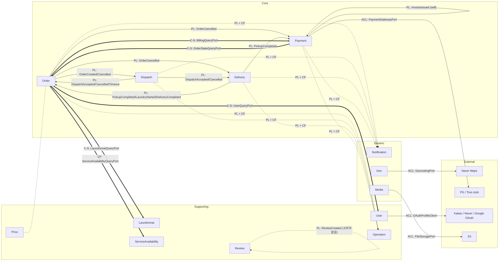

# 16. 컨텍스트 맵 (Context Map)

> 최종 수정일: 2026-09-08
> 상태: Draft
> 근거: `settings.gradle.kts`, [03-architecture](03-architecture.md), [04-module-communication](04-module-communication.md), [ADR-0003](adr/0003-module-decomposition-criteria.md), [ADR-0006](adr/0006-module-decomposition-reassessment.md), [ADR-0007](adr/0007-modular-monolith-over-microservices.md), 각 도메인 모듈의 `application/port/inbound`·`application/port/outbound`, `carry-app/adapter`, `@KafkaListener` 선언

---

## 1. 목적

ADR-0003이 "비즈니스 능력 = 모듈 경계"를 선언했고 ADR-0006이 13개 도메인 모듈을 각각 독립 바운디드 컨텍스트로 확인했다. 이 문서는 그 컨텍스트들 사이의 관계를 DDD 컨텍스트 맵 용어(Customer-Supplier, Conformist, Anticorruption Layer, Open Host Service, Published Language, Shared Kernel, Separate Ways, Partnership)로 라벨링한다. 라벨은 코드에서 실제로 관측되는 통신 경로만 근거로 붙였다. 문서상 계획만 있고 코드에 없는 경로는 라벨하지 않고 4절에 따로 적었다.

통신 메커니즘은 세 가지뿐이다.

| 메커니즘 | 위치 | 설명 |
|---|---|---|
| Kafka 통합 이벤트 | `carry-event` 정의, `carry-infra-kafka` Outbox 발행, 각 모듈 `adapter/inbound/kafka/*EventConsumer` 소비 | 상태 변경 전파. Debezium이 `*_outbox` 테이블을 `carry.{AggregateType}.events` 토픽으로 라우팅 |
| 동기 쿼리 포트 | 소비자 모듈 `application/port/outbound/*QueryPort` 정의, `carry-app/src/main/kotlin/com/carry/app/adapter/*QueryPortAdapter` 가 공급자 모듈의 inbound UseCase 에 위임 | 읽기 전용 조회. 어댑터 5개 |
| 공유 커널 | `carry-common`, `carry-event`, `carry-infra-persistence`, `carry-audit` | 모든 도메인 모듈이 컴파일 의존 |

---

## 2. 바운디드 컨텍스트 목록

분류 기준: Core 는 서비스의 경쟁력을 결정하는 주문·이행 흐름과 돈의 흐름. Supporting 은 Core 가 동작하기 위해 필요하지만 자체로 차별화 요소가 아닌 것. Generic 은 어느 서비스에나 있는 기능으로 외부 제품으로 대체 가능한 것.

| 컨텍스트 | 모듈 | 분류 | 책임 (한 줄) | 근거 |
|---|---|---|---|---|
| Order | `carry-order` | Core | 고객 주문의 생성·취소와 물리 흐름 상태(CREATED→DISPATCHED→PICKED_UP→IN_PROGRESS→COMPLETED)의 유일한 소유자. 물리 사가의 시작점이자 종결 지점 | `carry-order/.../domain/model/Order.kt`, `domain/vo/OrderEnums.kt` |
| Dispatch | `carry-dispatch` | Core | 주문에 캐리어를 배차한다(캐리어 선점·코디네이터 지정·수락·거절·타임아웃). 캐리어 권역과 페널티 기록도 소유 | `carry-dispatch/.../domain/model/Dispatch.kt`, `CarrierArea.kt`, `PenaltyRecord.kt` |
| Delivery | `carry-delivery` | Core | 배차 수락 이후 캐리어의 작업 단계(수거→계량→세탁→건조→배달)를 기록하고 실측 무게를 확정 | `carry-delivery/.../domain/model/Delivery.kt`, `DeliveryStep.kt` |
| Payment | `carry-payment` | Core | 인보이스 발행, 빌링키 자동과금, 재시도·연체, 환불, 정산 원장, PG 대사. 물리 흐름과 병렬인 결제 사가의 소유자 | `carry-payment/.../domain/model/Invoice.kt`, `Payment.kt`, `BillingKey.kt`, `LedgerEntry.kt`, `ReconciliationMismatch.kt` |
| User | `carry-user` | Supporting | 회원(CUSTOMER/CARRIER/COORDINATOR/ADMIN)·OAuth 신원·토큰·배송지 | `carry-user/.../domain/model/User.kt`, `ShippingAddress.kt`, `domain/vo/UserRole.kt` |
| Laundromat | `carry-laundromat` | Supporting | 세탁소 정보, 보유 옵션(세탁기/건조기/운동화), 위치 기반 근처 검색 | `carry-laundromat/.../domain/model/Laundromat.kt`, `NearbyLaundromat.kt` |
| Price | `carry-price` | Supporting | 주문 조건(단위·요청유형·세탁물 종류)별 옵션 가격 정책 | `carry-price/.../domain/model/PricePolicy.kt`, `domain/vo/PriceEnums.kt` |
| ServiceAvailability | `carry-service-availability` | Supporting | 서비스 권역(areaCode)의 상태·요일별 영업 스케줄·휴무일로 수거/배달 시각 가용성 판정 | `carry-service-availability/.../domain/model/ServiceArea.kt`, `OperatingSchedule.kt`, `HolidayOverride.kt` |
| Operation | `carry-operation` | Supporting | 운영 이벤트 타임라인·운영 요약 집계, 약관 관리 | `carry-operation/.../domain/model/OperationEvent.kt`, `OperationSummary.kt`, `Term.kt` |
| Review | `carry-review` | Supporting | 세탁소 리뷰 작성·통계 | `carry-review/.../domain/model/Review.kt`, `domain/vo/ReviewStatistics.kt` |
| Notification | `carry-notification` | Generic | 도메인 이벤트를 알림(알림톡/SMS/푸시)으로 변환해 발송, 디바이스 토큰 관리 | `carry-notification/.../domain/model/Notification.kt`, `DeviceToken.kt`, `domain/vo/NotificationEnums.kt` |
| Geo | `carry-geo` | Generic | 주소↔좌표 변환(지오코딩·역지오코딩), 외부 지도 API 래핑 | `carry-geo/.../application/port/outbound/GeocodingPort.kt`, `ReverseGeocodingPort.kt` |
| Media | `carry-media` | Generic | 파일 업로드·다운로드 및 업로드 상태(UPLOADING/COMPLETED/FAILED) | `carry-media/.../domain/model/MediaResource.kt`, `domain/vo/MediaStatus.kt` |

Notification 을 Generic 으로 둔 이유: 발송 채널과 템플릿 렌더링은 외부 알림 서비스로 대체 가능하다. 다만 `NotificationType` 열거형이 Order/Dispatch/Payment 이벤트명을 그대로 옮긴 것이라(`NotificationEnums.kt`) 이 컨텍스트는 상류 컨텍스트들의 언어에 순응하는 Conformist 성격이 강하다(3절 참조).

---

## 3. 관계 테이블

방향은 "상류(U) → 하류(D)". 이벤트 관계에서 상류는 발행자, 동기 포트 관계에서 상류는 포트를 구현해 주는 공급자다. 라벨은 하류 관점의 보호 수단 유무로 정했다.

- Published Language(PL): 이벤트 계약이 `carry-event` 에 공개 스키마로 존재.
- Customer-Supplier(C-S): 하류가 포트 시그니처를 정의하고 상류가 이를 만족(하류가 요구를 명시).
- Open Host Service(OHS): 상류가 inbound UseCase 를 공개하고 여러 하류가 같은 진입점을 쓴다.
- Conformist(CF): 하류가 상류의 타입/명칭을 변환 없이 그대로 채택.
- Anticorruption Layer(ACL): 하류가 자기 포트를 정의하고 어댑터에서 외부 모델을 자기 모델로 번역.
- Shared Kernel(SK): 코드 자체를 공유.
- Separate Ways(SW): 통신 경로 없음.

### 3.1 컨텍스트 간 (이벤트)

| 상류 → 하류 | 이벤트 | 라벨 | 근거 파일 |
|---|---|---|---|
| Order → Dispatch | `OrderCreatedEvent`, `OrderCancelledEvent` | PL + C-S | 발행 `carry-order/.../application/service/OrderCommandService.kt`; 소비 `carry-dispatch/.../adapter/inbound/kafka/DispatchEventConsumer.kt`(`carry.Order.events`), 핸들러 `carry-dispatch/.../application/service/DispatchSagaHandler.kt` |
| Order → Delivery | `OrderCancelledEvent` | PL + C-S | `carry-delivery/.../adapter/inbound/kafka/DeliveryEventConsumer.kt`(`carry.Order.events`), `DeliverySagaHandler.kt` |
| Order → Payment | `OrderCancelledEvent` | PL + C-S | `carry-payment/.../adapter/inbound/kafka/PaymentEventConsumer.kt`(`consumeOrderEvents`), `PaymentSagaHandler.kt` |
| Order → Notification | `OrderCreatedEvent` | PL + CF | `carry-notification/.../adapter/inbound/kafka/NotificationEventConsumer.kt`, `NotificationSagaHandler.kt` |
| Order → Operation | `OrderCreatedEvent`, `OrderCancelledEvent` | PL + CF | `carry-operation/.../adapter/inbound/kafka/OperationEventConsumer.kt`, `OperationSagaHandler.kt` |
| Dispatch → Order | `DispatchAcceptedEvent`, `DispatchCancelledEvent`, `DispatchTimeoutEvent` | PL + C-S | 발행 `carry-dispatch/.../application/service/DispatchCommandService.kt`; 소비 `carry-order/.../adapter/inbound/kafka/OrderEventConsumer.kt`(`consumeDispatchEvents`), `OrderSagaHandler.kt` |
| Dispatch → Delivery | `DispatchAcceptedEvent`, `DispatchCancelledEvent` | PL + C-S | `DeliveryEventConsumer.kt`(`carry.Dispatch.events`), `DeliverySagaHandler.kt`. Delivery 애그리거트는 이 이벤트로 생성된다 |
| Dispatch → Notification | `DispatchAcceptedEvent` | PL + CF | `NotificationEventConsumer.kt` |
| Dispatch → Operation | `DispatchAcceptedEvent` | PL + CF | `OperationEventConsumer.kt` |
| Delivery → Order | `PickupCompletedEvent`, `LaundryStartedEvent`, `DeliveryCompletedEvent` | PL + C-S | 발행 `carry-delivery/.../application/service/DeliveryCommandService.kt`; 소비 `OrderEventConsumer.kt`(`consumeDeliveryEvents`) |
| Delivery → Payment | `PickupCompletedEvent` | PL + C-S | `PaymentEventConsumer.kt`(`consumeDeliveryEvents`), `carry-payment/.../application/service/InvoiceService.kt#createInvoiceFromPickup` |
| Delivery → Notification | `PickupCompletedEvent`, `DeliveryCompletedEvent` | PL + CF | `NotificationEventConsumer.kt` |
| Delivery → Operation | `DeliveryCompletedEvent` | PL + CF | `OperationEventConsumer.kt` |
| Payment → Payment (자체 소비) | `InvoiceIssuedEvent` | PL (내부 사가 진입점) | `PaymentEventConsumer.kt#consumePaymentEvents`, `carry-payment/.../application/service/AutoChargeService.kt` |
| Payment → Notification | `InvoiceIssuedEvent`, `PaymentCompletedEvent`, `PaymentFailedEvent`, `RefundCompletedEvent` | PL + CF | `NotificationEventConsumer.kt` |
| Payment → Operation | `PaymentCompletedEvent` | PL + CF | `OperationEventConsumer.kt` |
| Review → (없음) | `ReviewCreatedEvent` | PL, 소비자 없음 | 발행 `carry-review/.../application/service/ReviewCommandService.kt`(aggregateType `Review`). `carry.Review.events` 를 구독하는 `@KafkaListener` 가 없다 |

### 3.2 컨텍스트 간 (동기 쿼리 포트)

| 하류(포트 정의) → 상류(공급) | 포트 / UseCase | 라벨 | 근거 파일 |
|---|---|---|---|
| Order → User | `UserQueryPort.getShippingAddress` → `ShippingAddressUseCase.getAddress` | C-S + ACL 성격 | `carry-order/.../application/port/outbound/UserQueryPort.kt`, `carry-app/.../adapter/UserQueryPortAdapter.kt`. 어댑터가 User 의 `ShippingAddress` 를 Order 의 `OrderShippingAddress` VO 로 필드 단위 번역한다 |
| Order → Laundromat | `LaundromatQueryPort.existsById` → `LaundromatQueryUseCase.getById` | C-S | `carry-order/.../application/port/outbound/LaundromatQueryPort.kt`, `carry-app/.../adapter/LaundromatQueryPortAdapter.kt`. 어댑터가 `LaundromatNotFoundException` 을 Boolean 으로 흡수 |
| Order → ServiceAvailability | `ServiceAvailabilityQueryPort.checkAvailability` → `ServiceAvailabilityQueryUseCase.checkAvailability` | CF | `carry-order/.../application/port/outbound/ServiceAvailabilityQueryPort.kt`, `carry-app/.../adapter/ServiceAvailabilityQueryPortAdapter.kt`. 시그니처가 동일하고 예외도 상류 것이 그대로 전파된다 |
| Order → Payment | `BillingQueryPort.hasActiveBillingKey/hasOverdueInvoice` → `BillingQueryUseCase` | C-S | `carry-order/.../application/port/outbound/BillingQueryPort.kt`, `carry-payment/.../application/port/inbound/BillingQueryUseCase.kt`, `carry-app/.../adapter/BillingQueryPortAdapter.kt`. `BillingQueryUseCase` 주석이 "carry-order 의 주문 생성 전제조건 조회"라고 명시해 상류가 하류 요구에 맞춰 만든 진입점임을 드러낸다 |
| Payment → Order | `OrderStateQueryPort.isInvoiceable/findCarrierId` → `OrderQueryUseCase.getOrderForCoordinator` | C-S + ACL 성격 | `carry-payment/.../application/port/outbound/OrderStateQueryPort.kt`, `carry-app/.../adapter/OrderStateQueryPortAdapter.kt`. 어댑터가 Order 의 상태 열거형과 예외를 Payment 가 원하는 Boolean/nullable 로 번역 |

Order ↔ Payment 는 이벤트(Order→Payment 취소, Delivery 경유 인보이스)와 동기 포트 양방향(Order→Payment 빌링 전제조건, Payment→Order 인보이스 가능 여부)이 동시에 존재하는 유일한 쌍이다. 어느 쪽도 상대의 모델을 직접 참조하지 않고 각자 포트를 정의하므로 Partnership 이 아니라 "양방향 Customer-Supplier" 로 둔다.

### 3.3 외부 시스템

| 컨텍스트 → 외부 | 포트 → 어댑터 | 라벨 | 근거 파일 |
|---|---|---|---|
| Geo → Naver Maps API | `GeocodingPort`, `ReverseGeocodingPort` → `NaverGeocodingAdapter`, `NaverReverseGeocodingAdapter`(+ Redis 캐시, 서킷브레이커 데코레이터) | ACL | `carry-geo/.../application/port/outbound/GeocodingPort.kt`, `carry-geo/.../adapter/outbound/external/naver/NaverGeocodingAdapter.kt`(`NaverGeocodingResponse.toDomain()` 으로 `GeocodingResult` 번역), `adapter/outbound/cache/`, `adapter/outbound/resilience/` |
| Payment → PG (Toss, 현재 스텁) | `PaymentGatewayPort`, `PgProviderAdapter`, `PaymentGatewayResolver` → `StubPgProviderAdapter`(local 프로파일), `CircuitBreakerPaymentGateway`, `PgProviderRegistry` | ACL | `carry-payment/.../application/port/outbound/PaymentGatewayPort.kt`(`PgBillingChargeRequest`/`PgPaymentResult`/`PgTransactionRecord` 등 포트 전용 DTO), `adapter/outbound/stub/StubPgProviderAdapter.kt`, `adapter/outbound/resilience/` |
| User → Kakao/Naver/Google OAuth | `OAuthProfileClient`, `OAuthProfileResolver` → `KakaoOAuthClient`, `NaverOAuthClient`, `GoogleOAuthClient`, `OAuthProfileClientResolver` | ACL | `carry-user/.../application/port/outbound/OAuthProfileClient.kt`(공급자별 응답을 `OAuthProfile` 하나로 정규화), `carry-user/.../adapter/outbound/auth/*OAuthClient.kt` |
| Media → S3 | `FileStoragePort` → `carry-infra-s3` 클라이언트 | ACL | `carry-media/.../application/port/outbound/FileStoragePort.kt` |
| Notification → 알림톡/SMS/푸시 | `NotificationSenderPort` | ACL(구현 상태는 미확인) | `carry-notification/.../application/port/outbound/NotificationSenderPort.kt` |

이 다섯 곳 어디에도 `AntiCorruptionLayer` 라는 이름의 클래스는 없다. 헥사고날의 아웃바운드 포트 + 어댑터가 곧 ACL 이다. 판단 기준은 (1) 포트 시그니처가 도메인 어휘로만 정의되고, (2) 외부 API 의 응답 DTO 가 어댑터 패키지 밖으로 나오지 않는가였다. Geo 의 `NaverGeocodingResponse`, Payment 의 `Pg*` DTO(포트 파일 안에 있지만 외부 프로토콜이 아니라 포트 계약), User 의 `OAuthProfile` 모두 이 기준을 만족한다.

### 3.4 공유 커널

| 공유 모듈 | 내용 | 의존 모듈 | 평가 |
|---|---|---|---|
| `carry-event` | 5개 패키지(order/dispatch/delivery/payment/review)의 이벤트 data class, `EventPublisherPort` | order·dispatch·delivery·payment·operation·review·notification | Published Language. 순수 Kotlin, Spring 무의존([03-architecture](03-architecture.md)). 이벤트 필드가 원시 타입(String/Long)이라 소비자가 발행자의 도메인 타입에 컴파일 결합되지 않는다 |
| `carry-common` | `BusinessException`, `DomainValidation.requireInput`, `ErrorCode`(72개 항목), `GlobalExceptionHandler`, `SagaLogContext`, `MetricsPort`, `ApiResponse` | 모든 모듈 | Shared Kernel. 예외 기반 클래스·응답 포맷·메트릭 포트는 기술 관심사라 공유가 적절하다. `ErrorCode` 와 `SagaLogContext` 는 4절 참조 |
| `carry-infra-persistence` | `BaseEntity`(id, auditing), `CollectionMapping.replaceAllFrom`, `JpaConfig` | 12개 도메인 모듈(geo 제외) | Shared Kernel. JPA 매핑 관용구만 담고 있어 도메인 개념 누출이 없다. 허용 가능 |
| `carry-audit` | `AuditPort`, `AuditAction`, `AuditLog` | order·dispatch·payment·app | Shared Kernel. 감사 로그 포트. `AuditAction`(`carry-audit/.../domain/AuditAction.kt`)에 `ORDER_CANCEL`, `PAYMENT_REFUND`, `BILLING_KEY_REGISTERED`, `DISPATCH_ASSIGN`, `DISPATCH_REJECT_PENALTY`, `DLQ_REDRIVE`, `DLQ_PURGE` 가 들어 있어 세 Core 컨텍스트의 행위 이름이 공유 모듈에 누적된다. `ErrorCode` 와 같은 종류의 누출이며 규모는 작다 |
| `carry-security` | JWT·인증 필터 | user·app | 기술 공유. user 만 의존하므로 커널이라기보다 인프라 |

---

## 4. Mermaid 다이어그램

실선: Kafka 이벤트(Published Language). 굵은 선: `carry-app` 어댑터가 결선하는 동기 쿼리 포트. 점선: 단방향 순응 소비 또는 통신 없음. Price–Order 사이 점선은 통신 경로가 없음을 뜻한다(5절).

---

## 5. 라벨이 드러낸 것

라벨을 붙이는 과정에서 불편한 자리가 드러났다. 각 항목은 현재 코드 상태에 대한 관찰이고, 수정 여부는 별도 판단이다.

### 5.1 Price 는 아무와도 연결되지 않는다 (Separate Ways)

`carry-price` 는 `PricePolicy.calculateTotal` 로 옵션 가격을 계산하지만, 인보이스 금액은 `carry-payment/.../application/service/InvoiceService.kt` 가 `BASE_RATE_PER_KG × actualWeight + DELIVERY_FEE + 10% 수수료` 로 자체 계산한다. Payment 는 `carry-price` 에 의존하지 않고, Order 도 `PriceQueryPort` 를 정의하지 않는다. Price 컨텍스트의 `LaundryItemType`/`OptionType`/`SubOptionType` 열거형은 `carry-price/.../domain/vo/PriceEnums.kt` 에만 있고 Order 는 `laundryItemType: String`, `SelectedOption(optionType: String, subOptionType: String)` 으로 받는다(`carry-order/.../domain/vo/SelectedOption.kt`). 즉 가격 정책과 청구 금액이 서로 다른 컨텍스트에서 독립적으로 정의되며, 두 값이 일치한다는 보장이 코드에 없다. 클라이언트가 Price API 로 예상가를 보고 주문하면 실제 청구는 다른 식으로 계산된다.

### 5.2 Notification 과 Operation 은 Conformist 이며 그 대가가 열거형 중복이다

`NotificationType`(`carry-notification/.../domain/vo/NotificationEnums.kt`)은 `ORDER_CREATED, DISPATCH_ACCEPTED, PICKUP_COMPLETED, INVOICE_ISSUED, PAYMENT_COMPLETED, ...` 로 상류 이벤트명을 그대로 옮겼다. `OperationEvent.eventType: String` 도 상류 이벤트명을 문자열로 저장한다. 상류에 이벤트가 추가·개명될 때마다 하류 열거형이 따라 바뀌어야 한다. Generic 컨텍스트가 Core 의 언어에 순응하는 것 자체는 DDD 관점에서 정상적인 선택이나, 알림 도메인 자체의 어휘("배차 안내", "카드 재등록 안내")가 없고 상류 이벤트명이 알림 유형을 대신하고 있다는 점은 알림 정책이 커질수록 부담이 된다.

### 5.3 Order → ServiceAvailability 는 Conformist 다

`ServiceAvailabilityQueryPort.checkAvailability(areaCode, pickupAt, deliveryAt)` 와 `ServiceAvailabilityQueryUseCase.checkAvailability` 의 시그니처가 같고, 어댑터(`ServiceAvailabilityQueryPortAdapter.kt`)는 위임만 한다. 상류 예외(`carry-service-availability/.../domain/exception/*`)가 Order 의 주문 생성 경로로 그대로 전파된다. 나머지 네 어댑터는 예외를 Boolean/null 로 흡수하거나 VO 를 번역하는 반면 이 어댑터만 번역이 없다. Order 가 가용성 실패를 자기 예외로 다루려면 이 자리를 ACL 로 바꿔야 한다.

### 5.4 `areaCode` 는 라벨 없는 공유 식별자다

`ServiceArea.areaCode`(service-availability), `ShippingAddress.areaCode`(user), `OrderCreatedEvent.areaCode`(event), `Dispatch.areaCode`/`CarrierArea.areaCode`(dispatch) 가 모두 `String` 이며, 이 코드 체계의 소유자는 ServiceAvailability 다. 네 컨텍스트가 같은 문자열 공간을 암묵적으로 공유하고 있는데, 이는 어떤 포트나 이벤트로도 표현되지 않은 Shared Kernel 이다. 권역 코드 개편이 일어나면 영향 범위가 컨텍스트 맵에 보이지 않는다.

### 5.5 `carry-common/ErrorCode` 는 도메인 개념을 담은 공유 커널이다

`carry-common/src/main/kotlin/com/carry/common/exception/ErrorCode.kt` 에 `ORDER_NOT_CANCELLABLE`, `BILLING_KEY_REQUIRED`, `OVERDUE_INVOICE_EXISTS`, `DISPATCH_ALREADY_ACCEPTED`, `PAYMENT_NOT_REFUNDABLE` 같은 모듈별 비즈니스 규칙 위반 코드가 한 파일에 모여 있다. 모든 모듈이 이 파일에 컴파일 의존하므로, 어느 컨텍스트의 규칙이 바뀌어도 공유 커널이 바뀐다. `SagaLogContext`(같은 모듈)도 `orderId` 를 MDC 키로 고정해 "사가 = 주문 단위"라는 Order 의 관점을 공통 모듈에 넣어 두었다. 응답 포맷 통일이라는 실용적 이유는 이해되지만, 컨텍스트 맵 관점에서는 각 모듈이 자기 `ErrorCode` 를 소유하고 공통 모듈은 HTTP 매핑 인터페이스만 두는 편이 경계에 맞다.

### 5.6 Delivery 가 Published Language 타입을 자기 포트와 REST DTO 에서 재사용한다

`carry-delivery/.../application/port/inbound/DeliveryCommandUseCase.kt` 와 `adapter/inbound/rest/dto/DeliveryWebDto.kt` 가 `com.carry.event.delivery.SelectedOptionSnapshot` 을 직접 import 한다. 이벤트 계약용 DTO 가 인바운드 유스케이스 시그니처와 웹 요청 스키마에 들어가 있어, 이벤트 스키마 진화(ADR-0005)가 REST API 계약에도 영향을 준다. 발행자 쪽에서 PL 이 도메인 안으로 역류한 사례다.

### 5.7 Review → Laundromat 은 이벤트만 있고 소비자가 없다

`ReviewCreatedEvent` 는 `laundromatId`, `rating` 을 실어 발행되지만 구독자가 없다. Laundromat 은 `carry-event` 에 의존하지도 않는다(`carry-laundromat/build.gradle.kts`). 세탁소 평점 집계가 Laundromat 쪽에 반영될 의도로 보이나 현재는 Separate Ways 다. Review 는 리뷰 대상 세탁소나 주문의 존재도 검증하지 않는다(`carry-review/.../application/port/outbound` 에 쿼리 포트 없음).

### 5.8 Payment 의 자체 소비는 이벤트 계약의 용도가 둘이라는 뜻이다

`InvoiceIssuedEvent` 는 Notification 이 소비하는 공개 계약이면서 동시에 Payment 내부 사가(`AutoChargeService.chargeInvoice`)의 진입 신호다. 외부용 PL 과 내부 워크플로 트리거가 같은 스키마를 쓰므로, 내부 사정으로 필드를 바꾸면 외부 소비자 계약이 함께 바뀐다. ADR-0004 의 코레오그래피 선택과 일관되지만 PL 의 소유 경계는 흐려진다.

### 5.9 문서와 코드의 어긋남

- ADR-0003 은 `PaymentQueryPort`(carry-delivery 정의)와 `*QueryPortAdapter` 4개를 언급하지만, 현재 `carry-delivery/.../application/port/outbound` 에는 `DeliveryPersistencePort` 만 있고 `carry-app/adapter` 에는 어댑터가 5개(`BillingQueryPortAdapter`, `LaundromatQueryPortAdapter`, `OrderStateQueryPortAdapter`, `ServiceAvailabilityQueryPortAdapter`, `UserQueryPortAdapter`)다. ADR-0007 의 "Payment 동기 결합은 `PaymentQueryPort` 하나뿐" 도 같은 이유로 현재와 다르다. 실제 Payment 의 동기 결합은 `BillingQueryPort`(Order 가 소비)와 `OrderStateQueryPort`(Payment 가 소비) 둘이다.
- [04-module-communication](04-module-communication.md) 의 "주문 상세 조회 시 결제 상태 필요 → Order → Payment 동기" 예시는 코드에 없다. Order 가 Payment 에 묻는 것은 빌링키 유무와 연체 여부뿐이다.
- [03-architecture](03-architecture.md) 의 패키지 구조(`infrastructure/`, `presentation/`, `domain/repository/`)는 실제 구조(`adapter/inbound|outbound`, `application/port/*`)와 다르다. ADR-0003 의 "헥사고날 3계층" 서술이 현재 코드와 맞다.
